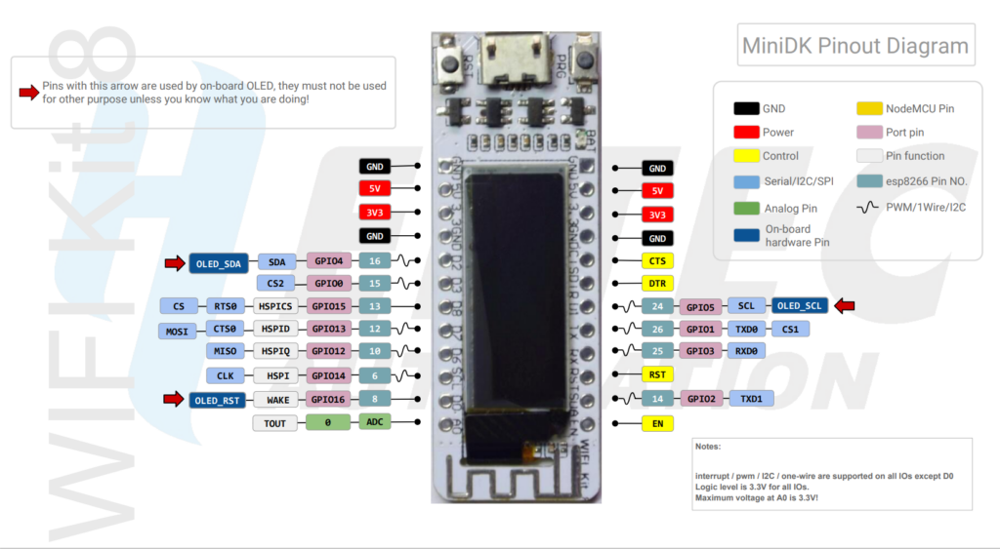
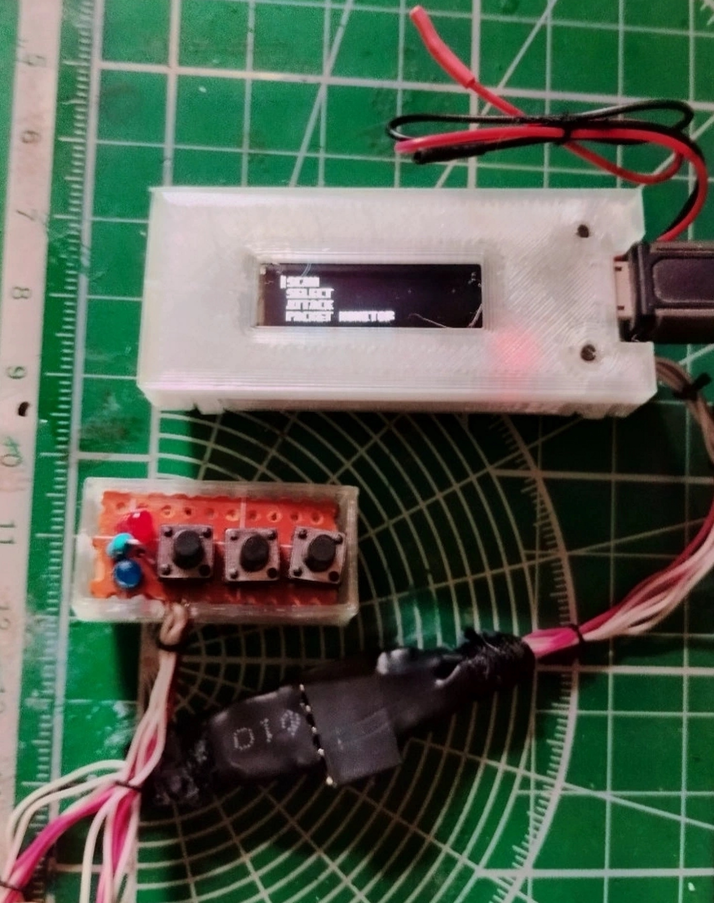

# Deauther port for Heltec Wifi 8 Kit
This repository contains modified source code, which can be compiled and flashed to Heltec Wifi 8 kit.

This board is pretty outdated, so I have included all needed libraries:

* Board support kit for Arduino IDE is NOT NEEDED. Deauther uses patched libs to allow packed injecton. Board support kit for deauther boards must be installed. See original readme DIY kit.
* Heltec support library from https://github.com/HelTecAutomation/Heltec_ESP8266/tree/1.0.3 is already included in src folder and utilized in source code with needed patches


This port is inspired by https://github.com/LmfaoHax/Heltec-deauther, however it did not worked OOB, so I decided to make some more modifications.

## Changes introduced

* Some OLED support libraries are removed, since this fork is targeted to Heltec Wifi 8 only
* Number lines in menu reduced, like in LmfaoHax version
* Heltec library is used to work with OLED screen
* Fonts regenerated to make them smaller
* Packet monitor reconfigured to use smaller display
* Heltec library is patched to make in buildable with deauther-based hardware.

## Configuration
* 3 buttons
* 2 LEDs (red and blue) connected via common anode


### Wiring

Image taken from Heltec site https://heltec.org/project/wifi-kit-8/



| Pin | Usage            | Comment                         |
|-----|------------------|---------------------------------|
| 14  | UP button        | Menu navigate up                |
| 12  | DOWN button      | Menu navigate down              |
| 13  | A button         | Menu select                     |
| 2   | RED LED Cathode  | Attack indication               |
| 15  | Blue led cathode | Scan indication                 |
| GND | GND              | Buttons second pin              |
| 5V  | Common anode     | Connect via 1K resistor to LEDS |


So generally one need 3 pushbuttons, 2 diodes of different color and one resistor.

## Flashing

Select board *"Generic ESP8266"* from *Deauther package* in Arduino IDE boards manager. 

This is vital to make it work, since binary patched network lib is used to allow packet ingestion.

The rest settings are:

| Setting           | Value                             | Comment                                                                                    |
|-------------------|-----------------------------------|--------------------------------------------------------------------------------------------|
| Built-in LED      | 2                                 | This will be anyway overwritten in code                                                    | 
| Upload speed      | 115200                            |                                                                                            |
| CPU Frequency     | 160 Mhz                           |                                                                                            |
| Crystal frequency | 26 Mhz                            |                                                                                            |
| Flash size        | 1MB FS:64KB OTA:~470KB            |                                                                                            |
| Flash mode        | DOUT (compatible)                 |                                                                                            |
| Flash frquency    | 40 Mhz                            |                                                                                            |
| Reset Method      | dtr (aka nodemcu)                 |                                                                                            |
| Debug port        | Disabled                          |                                                                                            |
| Debug level       | None                              |                                                                                            |
| lwIP variant      | v2 Lower Memory                   |                                                                                            |
| VTables           | Flash                             |                                                                                            |
| Exceptions        | Legacy (new can return nullptr)   | Other settings caused instability                                                          |
| Erase flash       | All flash contents                | This is for the first time, use other modes to retain settings for next flashes if needed. |
| SSL Support       | All SSL ciphers (most compatible) | No idea where SSL is used, just leaving as default. Probably can be tweaked                |
| Deauther config   | None                              | No preset config. It is assumed, we will configure via serial port after flash             |

Disconnect your board, press "PRG" button and connect to your host. Flash as usual in Arduino IDE.

Further setup instructions can be found in original readme or use online manual here: https://deauther.com/docs/diy/display-setup

Essential to enable your screen (it should show you "OLED initial done"):
```commandline
set display=true
save
reboot
```

## Next steps
Just follow original guide to:
* Test buttons
* Test LEDs
* Configure AP settings
* Whatever

## Useful stuff

Fancy 3D-printed enclosure can be found here: https://www.thingiverse.com/thing:3510594

There is also an option to connect LiPo battery for your Heltec Wifi8 Kit. Not sure about the usefullness of this modification, but one will need extra power switch to turn off battery power.

Any modern and not-so-modern power bank will do the job, but if you are feeling adventurous, you can try to use this enclosure: https://www.thingiverse.com/thing:3738494

## Assembled version


Assembled version above. Minimal detachable control "board".
